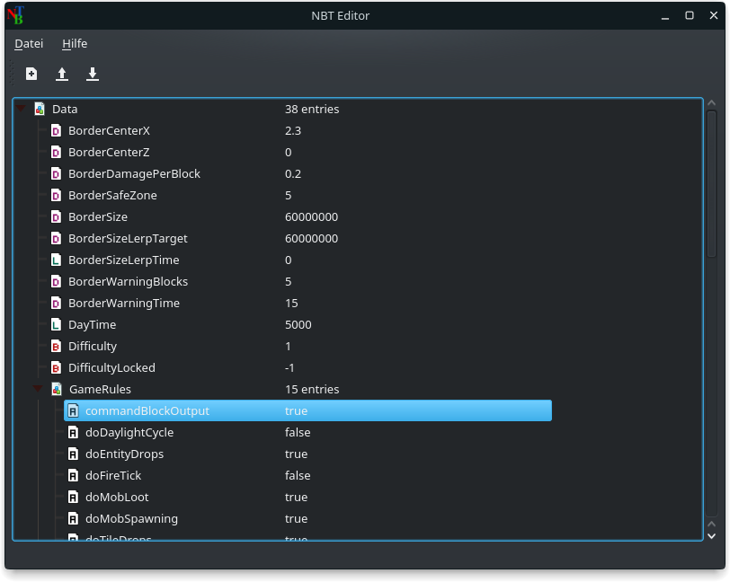

# NBTEditor
A nbt editor software to edit minecraft binary files. Currently it can be used to edit .dat and .schematic files.  


## Download
- Windows Portable: http://dl.howaner.de/NBTEditor/latest/NBTEditor.zip
- Windows Installer: http://dl.howaner.de/NBTEditor/latest/NBTEditor.msi
- Ubuntu 16.04 Deb: http://dl.howaner.de/NBTEditor/latest/nbteditor_amd64.deb


## Used frameworks
The software is written in C++ with the Qt5 framework and Zlib.

## How to compile it on linux
```
apt-get install build-essential qt5-default qttools5-dev-tools cmake zlib1g-dev
mkdir build
cmake ..
make
./nbteditor
```

## How to compile it on windows
1. Install qt5 developer framework with mingw-32 compiler
2. Install cmake
3. Compile static zlib library
4. Follow linux introductions